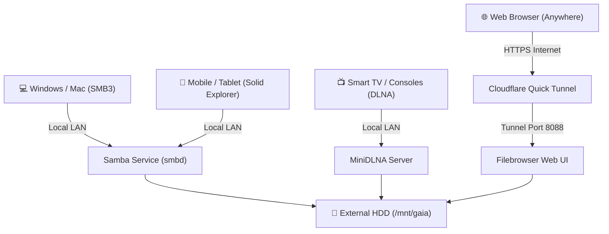

# 🚀 SimpleNAS Setup - Linux NAS & Remote Web Sharing Server

[](#-lisensi)
[](https://ubuntu.com)
[](#-fitur-utama)

Solusi lengkap pengubahan Harddisk Eksternal (NTFS/ext4) menjadi **Network Attached Storage (NAS) Enterprise** berbasis Linux. Dilengkapi fitur *Auto-Mount*, *Hot-Plug*, *Avahi/WSDD Network Discovery*, *DLNA Media Server*, *Web UI File Manager*, dan *Public Remote Access (Cloudflare HTTPS Quick Tunnel)*.

---

## 📐 Arsitektur Sistem



---

## ✨ Fitur Utama

- 💾 **Auto-Mount & Hot-Plug Resilient:** Harddisk otomatis ter-mount saat booting (`/etc/fstab`) dan otomatis direkonek instan (*on-demand*) saat kabel USB dicabut-colok (`x-systemd.automount`).
- ⚡ **Optimasi Performa NAS & Apple Fruit Extensions:** Menggunakan SMB3 dengan *Asynchronous I/O* dan ekstensi *Apple VFS Fruit* untuk transfer file super cepat dan bersih di macOS/iOS.
- 📡 **Multi-Platform Network Discovery:**
  - **WSDD / NetBIOS:** Terdeteksi otomatis di Windows File Explorer (`Network`).
  - **Avahi / Bonjour:** Terdeteksi otomatis di Mac Finder & iOS Files app.
- 📺 **DLNA Media Server (MiniDLNA):** Streaming video, film, foto, dan musik secara nirkabel langsung ke Smart TV, Android TV, dan konsol game.
- 🌐 **Web File Manager & File Link Sharing (Filebrowser):** Tampilan Web modern serasa Google Drive / Dropbox pada port `8088`. Lengkap dengan fitur **Share Public Download Link** ber-password dan bermasa tenggang.
- ☁️ **Akses Jarak Jauh Tanpa VPN / Port Forwarding (Cloudflare Tunnel):** Membuka akses Web NAS secara aman berbasis HTTPS dari mana saja di luar rumah.

---

## 📁 Struktur Repositori

```text
simplenas-setup/
├── .env.example                # Template variabel lingkungan
├── .env                        # File rahasia parameter & credential (TIDAK di-commit ke Git)
├── .gitignore                  # Menjaga file sensitif .env tidak ter-push
├── README.md                   # Dokumentasi proyek
├── install.sh                  # Master Deployment Script
└── scripts/
    ├── 01_setup_samba.sh       # Mount fstab & setup Samba daemon
    ├── 02_setup_nas.sh         # Struktur folder NAS, Avahi, MiniDLNA, & hdparm
    ├── 03_setup_filebrowser.sh # Web UI Manager pada port 8088
    ├── 04_setup_cloudflare.sh  # Remote Access via Cloudflare Tunnel
    └── 05_reset_filebrowser_password.sh # Utility reset password admin
```

---

## ⚙️ Konfigurasi Variabel Lingkungan (`.env`)

Seluruh data sensitif dan konfigurasi parameter dipisahkan ke dalam file `.env`:

| Variabel | Deskripsi | Default |
| :--- | :--- | :--- |
| `NAS_HDD_UUID` | UUID Partisi Harddisk Eksternal | `4E50DBC850DBB4C5` |
| `NAS_MOUNT_POINT` | Folder Lokasi Mount NAS | `/mnt/gaia` |
| `NAS_FILESYSTEM_TYPE` | Driver Filesystem (`ntfs-3g`, `ext4`) | `ntfs-3g` |
| `NAS_LINUX_USER` | Username Pemilik Berkas Linux | `bakhtiarrifai` |
| `NAS_NETBIOS_NAME` | Nama Server pada Jaringan Windows | `GAIANAS` |
| `FILEBROWSER_PORT` | Port Web UI Filebrowser | `8088` |
| `FILEBROWSER_ADMIN_USER` | Username Admin Web UI | `admin` |
| `FILEBROWSER_ADMIN_PASS` | Password Admin Web UI (Min 12 Char) | `admin12345678` |

---

## 🚀 Panduan Instalasi & Deployment

### 1. Clone Repositori
```bash
git clone https://github.com/username/simplenas-setup.git
cd simplenas-setup
```

### 2. Salin & Sesuaikan File `.env`
```bash
cp .env.example .env
nano .env
```
> **Tips:** Cari UUID harddisk eksternal Anda dengan menjalankan perintah `blkid`.

### 3. Jalankan Deployment Master Script
```bash
sudo ./install.sh
```

---

## 📱 Panduan Cara Akses NAS

### 1. Akses Lokal (Jaringan Rumah / Wi-Fi LAN)
* **Windows (File Explorer):** `\\192.168.50.195` atau `\\GAIANAS`
* **macOS (Finder `Cmd + K`):** `smb://192.168.50.195`
* **Android / iOS:** `smb://192.168.50.195` (User: Guest)
* **Smart TV (DLNA):** Buka aplikasi Media Player -> Pilih **Gaia NAS Media Server**
* **Web Browser Lokal:** `http://192.168.50.195:8088`

### 2. Akses Luar Rumah & Berbagi Link Download File
* **Web UI Cloudflare Tunnel:** Buka URL HTTPS publik yang dihasilkan oleh script `04_setup_cloudflare.sh`.
* **Membuat Link Download File:**
  1. Login ke Web UI Filebrowser.
  2. Klik kanan file/folder -> pilih **Share**.
  3. Salin link share (opsional: dapat di-shorten menggunakan [s.id](https://s.id) atau [tinyurl.com](https://tinyurl.com)).
  4. Bagikan link ke siapapun via WhatsApp/Email!

---

## 🔒 Pemeliharaan & Reset Password

Jika Anda ingin mereset password Web UI Filebrowser ke password baru di `.env`, jalankan:

```bash
sudo ./scripts/05_reset_filebrowser_password.sh
```

---

## 📄 Lisensi
Proyek ini dirilis di bawah lisensi MIT License.
